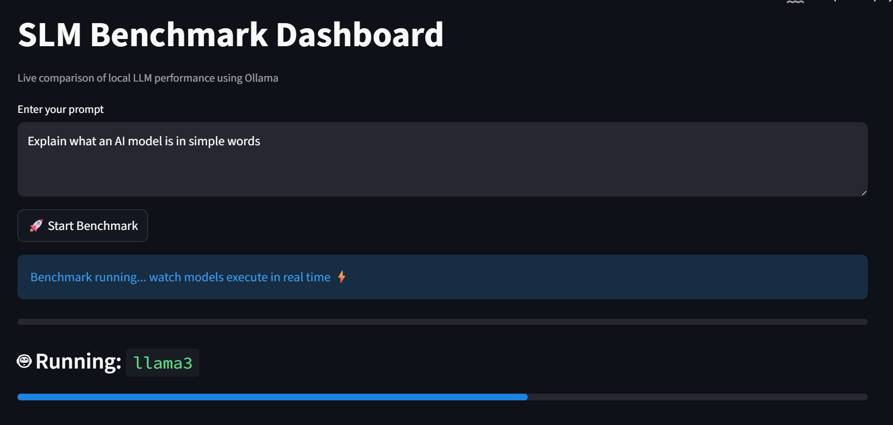

# Local SLM Benchmark Dashboard




## Installation

### 1. Clone the repository

```bash
git clone https://github.com/your-username/local-slm-benchmark.git
cd local-slm-benchmark
```

### 2. Create a virtual environment

```bash
python -m venv slm-env
source slm-env/bin/activate      # Mac/Linux
slm-env\Scripts\activate  # Windows
```

### 3. Install dependencies

```bash
pip install -r requirements.txt
```

### 4. Pull models via Ollama

Make sure [Ollama is installed](https://ollama.com/download), then:

```bash
ollama run llama3
ollama run mistral
ollama run phi3
```

### 5. Launch the dashboard

```bash
streamlit run app.py
```

---

## Results & Analysis

All three models were evaluated on identical prompts in a controlled local environment. Here's what I found:

### ⚡ Speed (Tokens per Second)

Phi-3 was the clear winner in raw throughput, followed by Mistral, with Llama 3 trailing due to its larger size. The gap was significant — smaller models are noticeably faster for local inference, which matters a lot on CPU-only setups.

### ⏱️ Latency (Response Time)

Latency followed the same pattern: Phi-3 responded fastest, Mistral sat in the middle, and Llama 3 had the highest latency. This scales predictably with model complexity and parameter count.

### 💬 Output Quality (Subjective Evaluation)

- **Llama 3** produced the most detailed, well-structured responses. For complex reasoning tasks, it was clearly the strongest.
- **Mistral** struck a solid balance — coherent, reasonably detailed, and fast enough to be practical.
- **Phi-3** was concise, sometimes to a fault. It answered correctly but often skipped the explanation depth the other two provided.

> **Key insight:** Faster models sacrifice reasoning depth. For lightweight or latency-sensitive use cases, Phi-3 is excellent. For anything requiring nuanced output, Llama 3 is worth the wait.

### 🏆 Final Ranking

| Rank | Model | Reason |
|------|-------|--------|
| 🥇 1st | **Llama 3** | Best output quality and reasoning depth |
| 🥈 2nd | **Mistral** | Strong balance of speed and quality |
| 🥉 3rd | **Phi-3** | Fastest inference, but least detailed responses |

**My recommendation:** Use Phi-3 if you need speed and concise answers. Use Llama 3 if quality matters more than latency. Mistral is the best all-rounder for general use.

## Use Cases

- Local LLM evaluation and selection
- AI model comparison research
- Edge AI performance testing
- Learning how LLM inference behaves under real conditions

---


